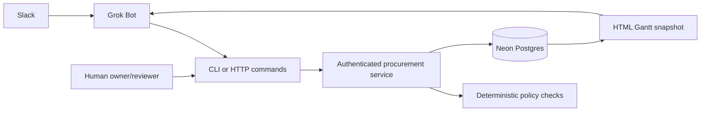

# Architecture

One TypeScript service, one CLI, and Neon Postgres. Grok Bot supplies conversation and research; Slack is a channel to that operator. The application does not call a model API or orchestrate agents.

## State and evidence

Requests have stable IDs. Append-only events determine request revision, status, selected quote, verified requirements, approvals, blockers, fulfillment, and feedback. The reducer is deterministic and has no external side effects. Vendor profiles and immutable quotes link evidence to requests. History is not hidden in chat memory.

Each write uses an actor/workspace-scoped idempotency key and a canonical payload hash. In a single database transaction the service locks the small team's workspace, rechecks actor authority and policy, writes records/events, and records the command result. This deliberately simple serialization makes aggregate simulated budgets and per-request event sequences coherent. It is intended for small-team procurement; high-throughput workloads would need narrower locking and query optimization.

Database constraints reject active duplicate orders and invalid states. Triggers reject updates/deletes of events, quotes and completed command records. Developer database owners remain trusted administrators; append-only does not mean tamper-proof against an administrator. Bot credentials provide no SQL access.

## Purchasing controls

Policy defines currency, routine per-order and daily caps, an expensive threshold, designated escalation owner, timezone and delegated categories/vendors/sites. Unknown landed costs and mandatory evidence block commitment. Quote validity and approval expiry are checked at execution. Approvals bind the selected quote, request revision, and monotonically increasing policy version.

Expensive and regulated purchases always use human ordering. Required permit evidence must cover the request's site/material and relevant purchase/delivery interval. Classification, technical review and financial approval are distinct decisions. The software records configured requirements; it does not decide which regulations apply.

Only simulation is implemented for automated checkout. Confirmed and unknown simulated orders consume authority in their original reservation period; an unknown result must be reconciled before retrying. A failed attempt releases its reservation. There is no actual payment, vendor booking, email send, or hidden browser checkout.

## Fulfillment and knowledge reuse

Partial receipts record quantities and arrival dates. Later technical acceptance is distinct from arrival. Completed-order lead time counts an order once, rather than counting every partial shipment as an independent observation. Original promises remain available when a supplier revises delivery. Real and simulated experience are returned separately; fictional observations never become real supplier-performance claims.

The Gantt is a dated projection of the same records. Its HTML is self-contained, escapes embedded data, contains no credentials or external scripts, and does not connect to the database. The bot refreshes it by re-exporting.

## Current boundaries

- Structured source URLs, notes, quotes and verified evidence are supported. Binary document storage, PDF/OCR extraction and passage indexing are not implemented.
- One bar per procurement, with calendar-day planning. No dependency/critical-path scheduler or drag-to-edit UI.
- Positive integer quantities; no accounting, payments, returns/refunds, split-vendor carts, or subscription execution.
- API keys define owner, reviewer, agent and requester authority. Requesters see their own/assigned requests; agents and reviewers are trusted workspace operators. No multi-tenant public signup or private medical-profile store.
- User-managed Grok Bot/Slack transport. Vendor email and proactive routines are follow-up work.
